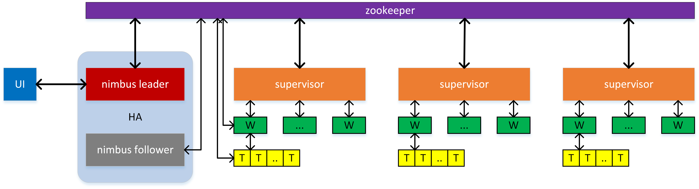
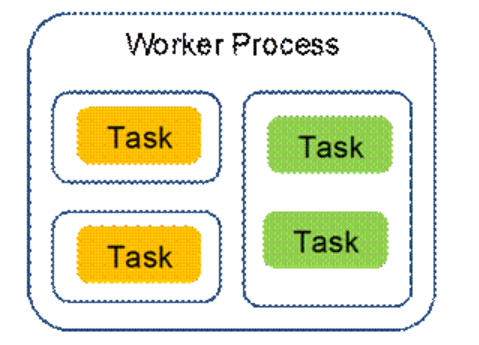

Storm 是一个基于 ZK 协调的分布式任务实时调度系统，属于流式（实时）计算引擎的一类。毫秒级延迟的分布式实时计算引擎。

#### JStorm 架构设计

JStorm 是在 storm 的基础上基于 java 语言重写而来（storm 采用 java 和 clojure 混合开发），并在原来的基础上进行了多项改进，主要包括：
- 简化模型设计：将 task 映射为一个线程，而不仅仅是一个逻辑执行单元
- 多维度资源调度：包括 CPU、内存、网络，以及存储等维度
- 网络通信层改造：采用更高性能的 netty + disruptor 替换原来的 zmq + blockingQueue
- 采样重构：滚动时间窗口、优化缓存性能、增量采样时间，以及减少无谓数据等
- 异步化处理：将 nextTuple 和 ack/fail 逻辑分离开，并在 worker 中采用单独线程负责进出数据的反序列化和序列化工作
- HA 机制：解决 storm nimbus 节点的单点问题

JStorm 的整体架构图如下：

从图中我们可以看到 JStorm 在设计上将集群中的节点分为 nimbus 和 supervisor 两类。其中 nimbus 节点相当于整个集群的调度者，基于 ZK 对整个集群进行调度，supervisor 节点则是整个集群中实际运行 topology 的节点。在一个 supervisor 节点中一般会启动多个 worker 进程，每个 worker 进程又包含多个 task 线程。我们提交的 topology 任务一般会包含多个组件（spout 和 bolt），每个组件依据其并行度配置会分配到相应数量的 task 任务，而每一个 task 任务都运行在对应的 task 线程上面。JStorm 是一个重度依赖于 ZK 的分布式调度系统，所有的工作组件（nimbus、supervisor、worker，以及 task）都会与 ZK 进行交互上报和更新自己的运行状态，同时获取其他工作组件的运行状态来指导自己接下去的运行。

- Nimbus：Streaming服务的控制中心节点，负责接收客户端提交的任务，并在集群中分发任务给Supervisor；同时监听状态等。在HA模式下包含主用Nimbus和备用Nimbus。

- Supervisor：负责监听并接受Nimbus分配的任务，根据需要启动和停止属于自己管理的Worker进程。Worker进程是运行具体处理组件逻辑的进程。每个Worker是一个JVM进程。

- ZooKeeper：ZooKeeper为服务中各进程提供分布式协作服务。Nimbus、Supervisor、Worker将自己的信息注册到ZooKeeper中，Nimbus据此感知各个角色的健康状态。

- Topology：一个Topology是Storm中运行的一个实时应用程序，一个Topology是由一组Spout组件（数据源）和Bolt组件（逻辑处理）通过Stream Groupings进行连接的有向无环图(DAG)。

- Worker：一个Worker是一个JVM进程，所有的Topology都是在一个或者多个Worker中运行的。Worker启动后是长期运行的，除非人工停止。Worker进程的个数取决于Topology的设置，且无设置上限，具体可获得调度并启动的Worker个数则取决于Supervisor配置的slot个数。

- Task：Topology里面的每一个Component（Spout/Bolt）节点都是并行运行的。 在Topology里面， 可以指定每个节点的并行度， Storm则会在集群里面分配相应的Task来同时计算，以增强系统的处理能力。

#### Topology 任务提交和运行的基本过程

下面我们简单陈述一下一个 topology 任务从提交到运行的基本执行过程。

- 当我们按照JStorm 的开发规范实现好自己的 topology 之后，我们需要将其打成 jar 包并执行相应的命令将其发布到集群，这期间我们主要是和 nimbus 节点进行通信，nimbus 会启动一个 thrift 服务，而提交任务的过程实际上就是一次 RPC 请求的过程。

- Nimbus节点会为本次任务提交请求创建对应的传输通道，然后等待用户上传 topology 的 jar 文件到本地。上传完成之后，nimbus 节点会依据用户的配置以及集群的运行状态开始为当前 topology 制定运行方案，包括需要分配多少 task，这些 task 需要多少 worker 进行执行，对应的 worker 需要落地到哪些 supervisor 节点才能保证集群的均衡等。当方案制定完成之后，nimbus 会将运行方案写入 ZK 对应的路径下面，并告知用户本次任务提交成功。

- Supervisor节点会定期检查 ZK 的任务分配路径以确定是否有新的任务需要执行，如果正好任务是被分配给当前 supervisor 节点，则 supervisor 会从 nimbus 节点下载当前 topology 对应的 jar 文件，并按照 nimbus 制定的运行方案在本地启动相应的 worker 去执行 topology 任务。同时 supervisor 会监控本地 worker 的运行状态，如果存在运行异常的 worker，则将其 kill 掉并通知 nimbus 重新分配。

- Nimbus节点作为调度者在实际中以单节点的形式运行，早期的 storm 在设计上没有引入 HA 机制，所以对于 nimbus 节点而言存在单点的隐患，虽然 nimbus 上的数据都是无状态的，但是当 nimbus 节点宕机之后，还是会在一定程度上影响整个集群的正常运行。JStorm 在改造时引入了 HA 机制，在 JStorm 中可以同时启动多个 nimbus 节点，这些节点在初始时都是 follower 角色，它们会将自身的节点信息上报给 ZK，然后依据优先级竞选成为 leader，期间需要 ZK 的介入来保证竞选结果的一致，当 nimbus leader 宕机之后，候选的 follower 会马上顶替一个上来，以保证集群的正常运行。